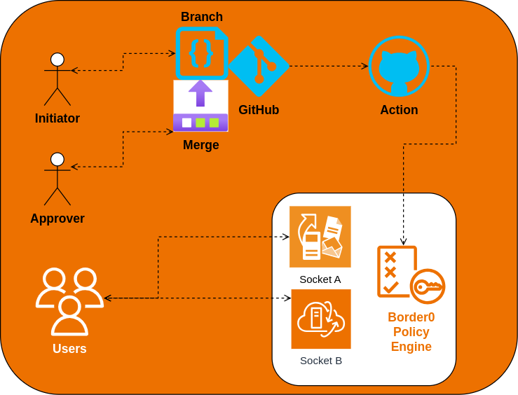

# Border0 policy management via GitHub Actions

Files with *.json extensions contain lice policy definitions. They are used by the Border0 GitHub Action to manage policy definitions in the Border0 service.
Create a new file with the *.json extension and add it to the repository. The file name will be used as the policy name in the Border0 service.

In order to update a policy definition, update the file and push the changes to the repository. The Border0 GitHub Action will automatically update the policy definition in the Border0 service.

Create a Branch and make required changes to the policy definition. Once the changes are ready, create a Pull Request to merge the changes into the master branch. Once the Pull Request is merged, the Border0 GitHub Action will automatically update the policy definition in the Border0 service.

